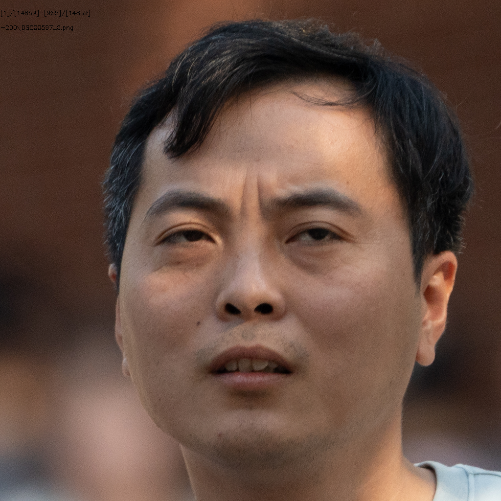

# 1311人数据处理

## 总体情况统计

+ ### ID数目

  + 源ID：**1311**
  + 有效ID：**1164**

+ ### 图片数量

  + 源图片有：**10826**
  + crop后图片：**14859**
  + 有效图片有：**7201**
  + 无效图片：**7658**

+ ### 参数设置

  + Crop Size：**1024**
  + Align Model：**ffhq**
  + Target Format：**png**
  + Blurry Thredhold：**200**
  + Affine Size：**16**
  + DPI：**300**

+ **单ID图片数：49**

## 1.模糊

#### （1）DSC00004

#### （2）DSC00032

#### （3）DSC00102

#### （4）DSC00181

#### （5）DSC00205

#### （6）DSC00237

#### （7）DSC00274

#### （8）DSC00324

#### （9）DSC00453

#### （10）DSC00532

#### （11）DSC00549

#### （12）DSC00624

#### （13）DSC00759

#### （14）DSC03956

#### （15）DSC04195

#### （17）DSC04343

#### （18）DSC04484

#### （19）DSC04761

#### （20）DSC05017

#### （21）DSC05500

#### （22）DSC06573

#### （23）DSC06626

#### （24）DSC06703

#### （25）DSC07116

#### （26）DSC07147

#### （27）DSC07297

#### （28）DSC08120

#### （28）DSC08537

## 2.遮挡

#### （1）DSC00460

## 3.侧脸

#### （1）DSC09514

## 4.噪点（噪点数据较多，前5000张图片基本上都是噪点）

#### （1）DSC00373

#### （2）DSC00597

#### （3）DSC00735

#### （4）DSC01165

#### （5）DSC04537

#### （6）DSC04887

#### （7）DSC04919

#### （7）DSC07169

#### （8）DSC07182

#### （9）DSC07370

