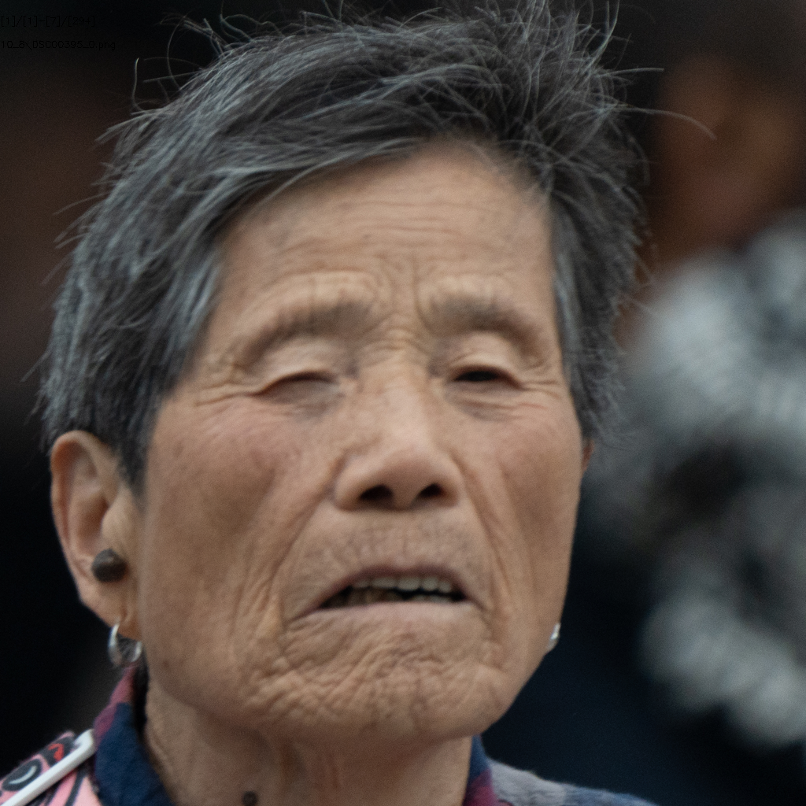
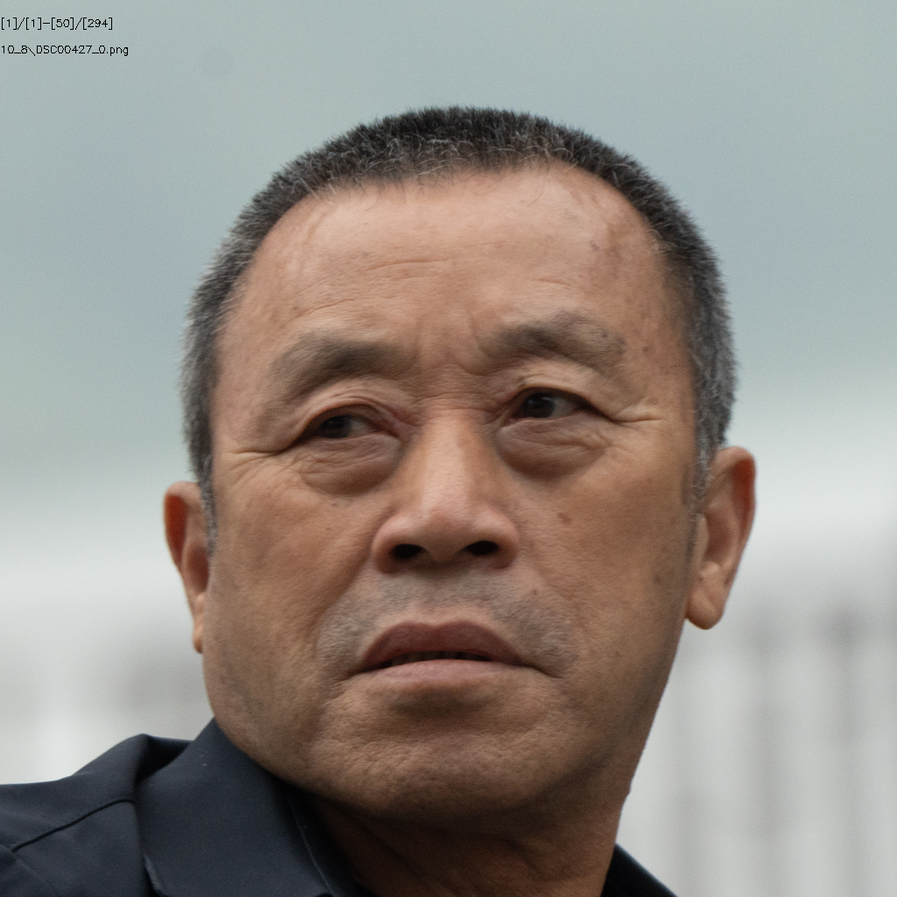
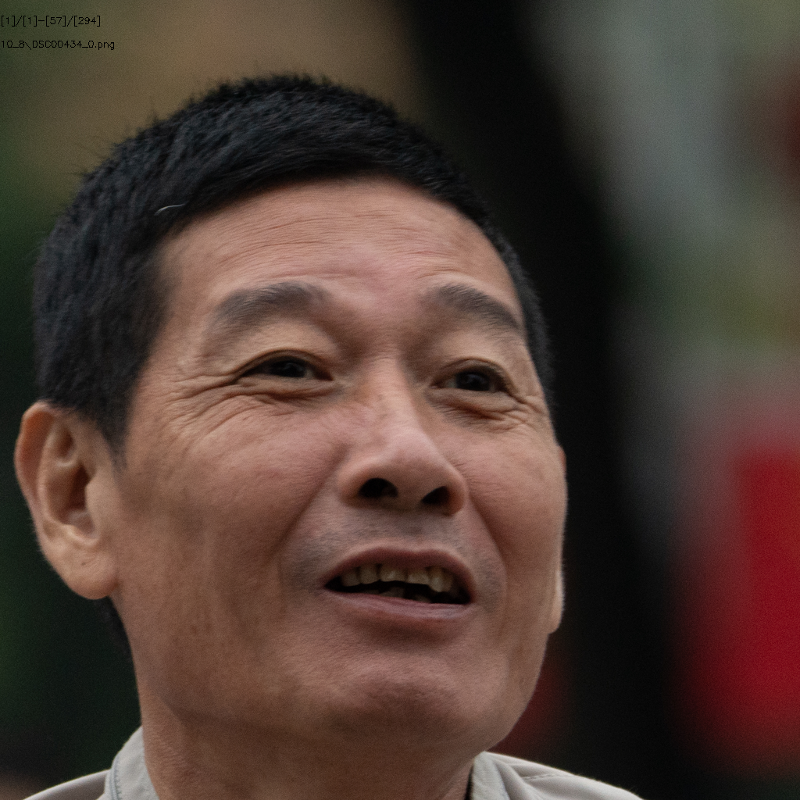
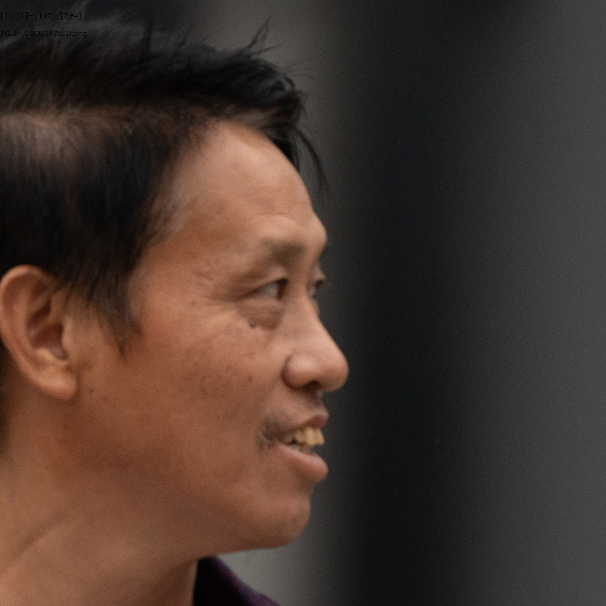
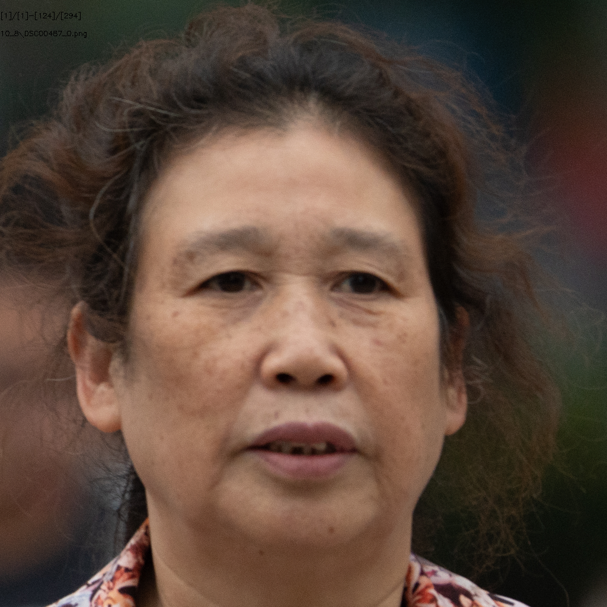
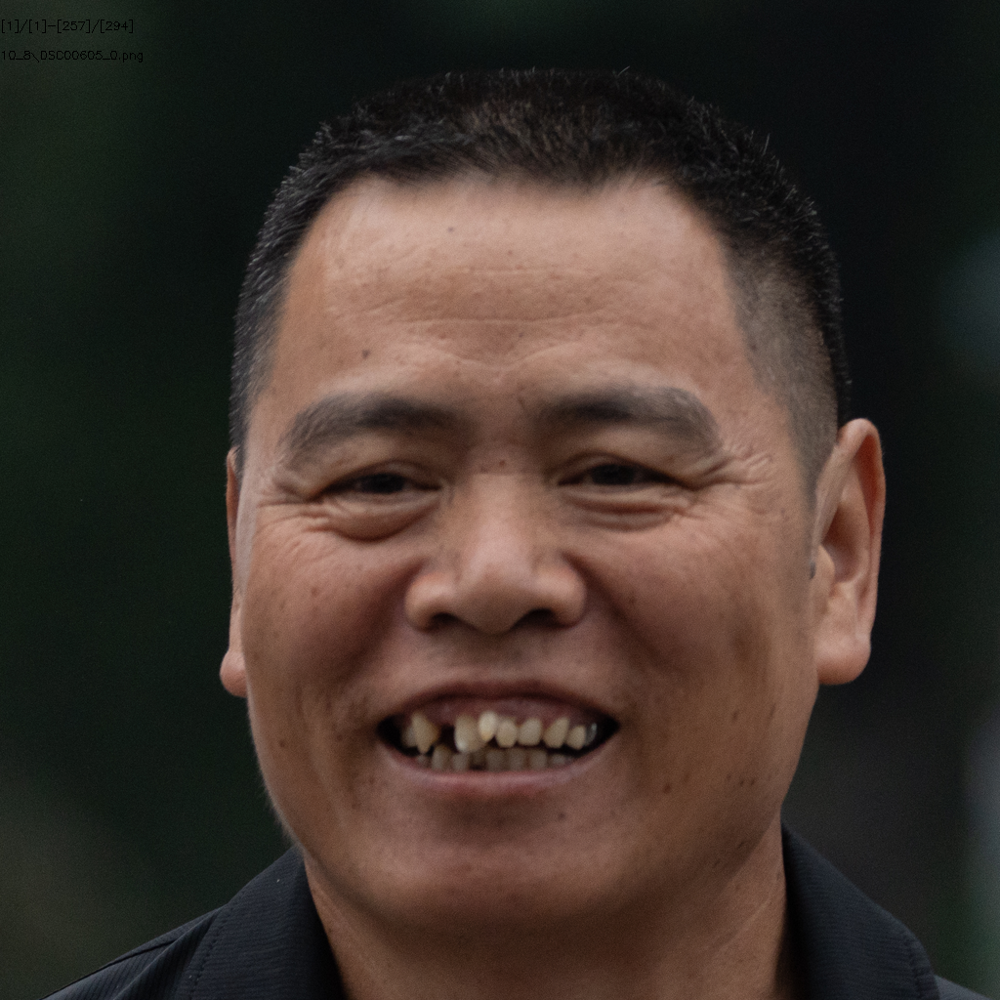
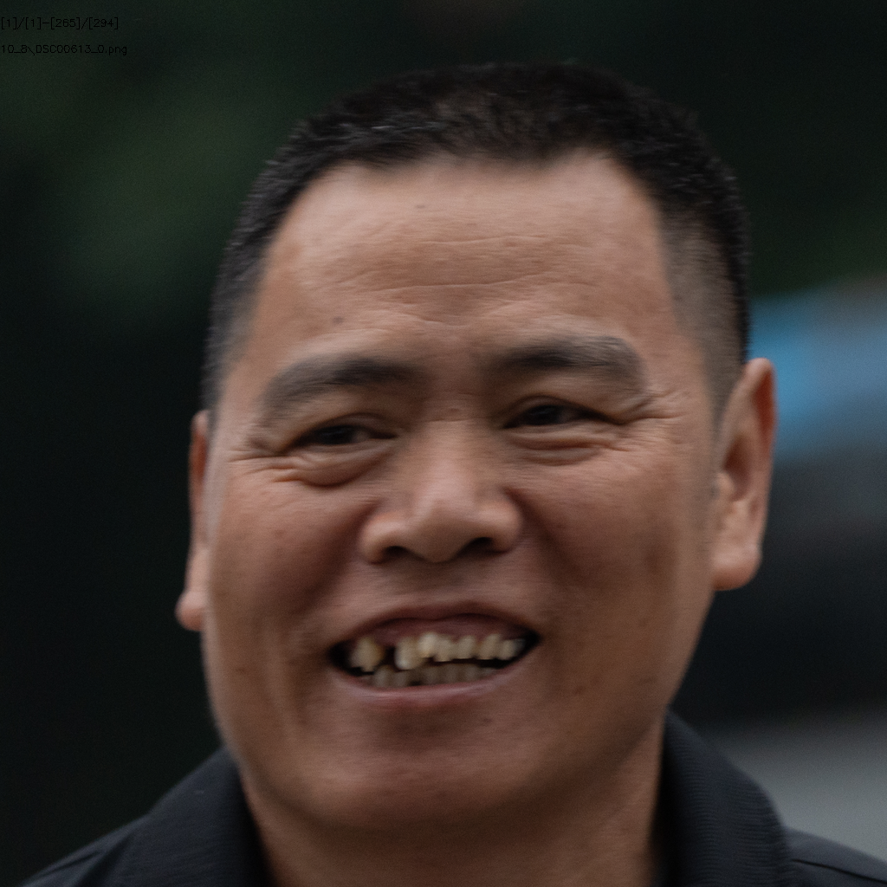

# 337人10.8号数据处理

## 总体情况统计

+ ### ID数目

  + 源ID：**337**
  + 有效ID：**22**

+ ### 图片数量

  + 源图片：**225**
  + crop后图片：**294**
  + 可用图片：**192**
  + 无用图片：**102**

### 参数设置

+ Crop Size：**1024**
+ Align Model：**ffhq**
+ Target Format：**png**
+ Blurry Thredhold：**30**
+ Affine Size：**16**
+ DPI：**300**

## 1.模糊

#### （1）DSC00395

#### （2）DSC00427

#### （3）DSC00434

#### （4）DSC00475

#### （5）DSC00487

#### （6）DSC00605

