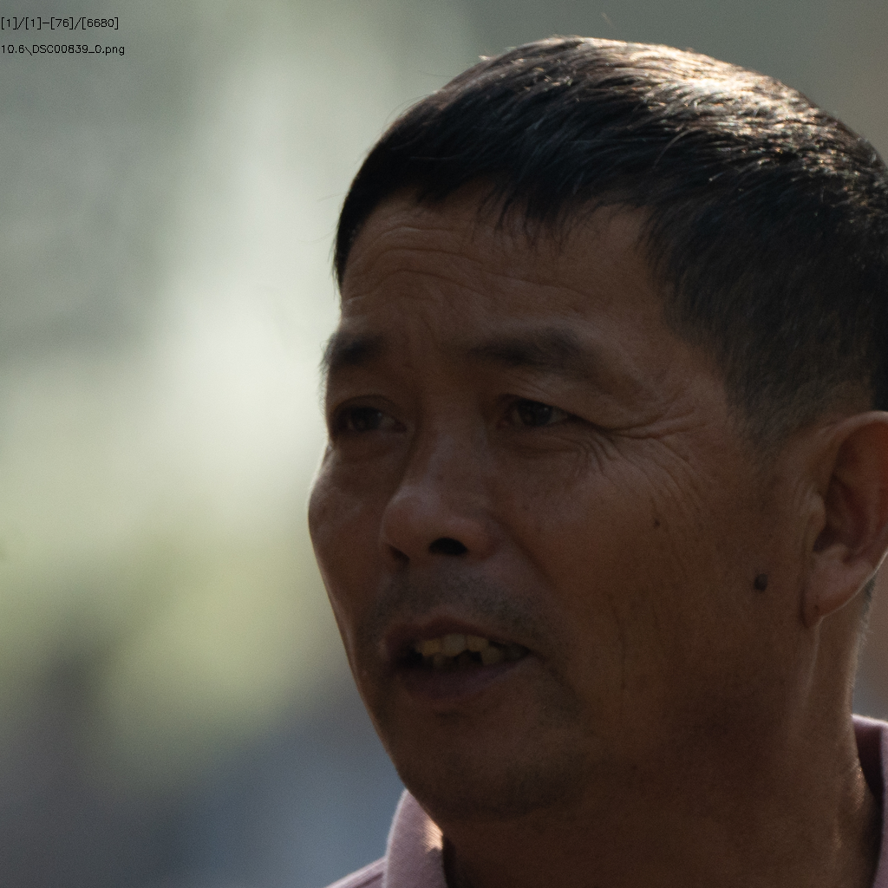
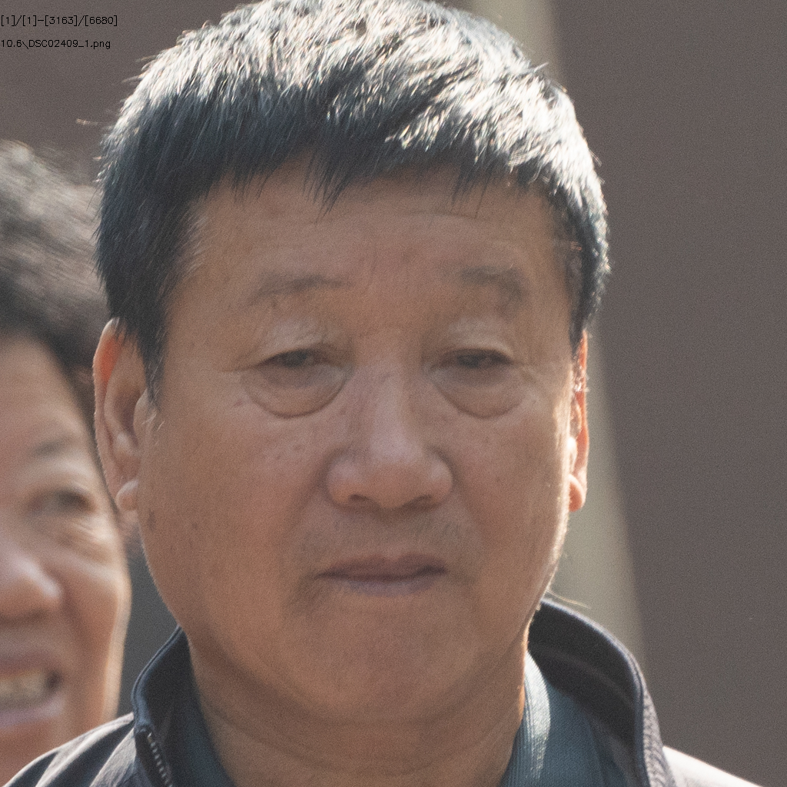
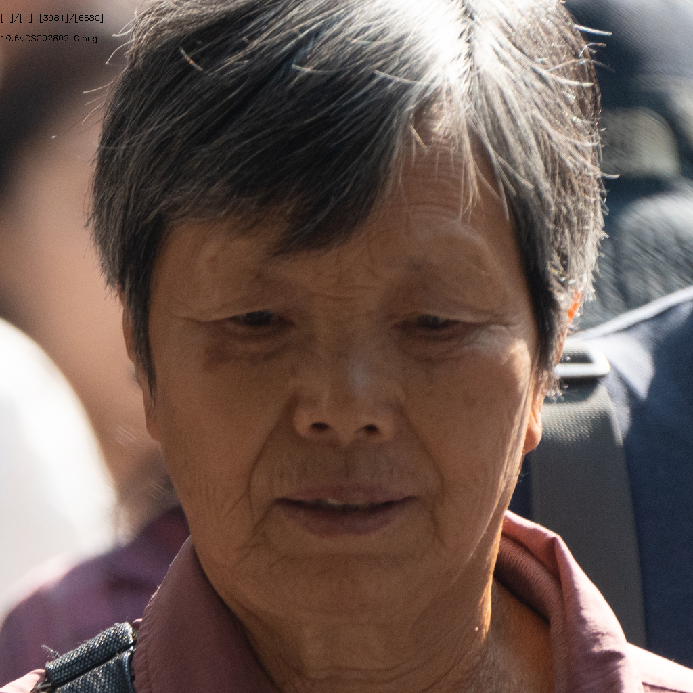

# 365人10.6号数据处理

## 总体情况统计：

+ ### ID数目
  + 源ID：**365**
  + 有效ID：**376**

+ ### 图片数量
  + 源图片有：**3572**
  + crop后图片：**6680**
  + 有效图片有：**3499**
  + 无效图片：**3181**

+ ### 参数设置

  + Crop Size：**1024**
  + Align Model：**ffhq**
  + Target Format：**png**
  + Blurry Thredhold：**30**
  + Affine Size：**16**
  + DPI：**300**

## 1.模糊的问题

#### （1）DSC00839

#### （2）DSC01194

#### （3）DSC01236

#### （4）DSC01310

#### （5）DSC01350

#### （6）DSC01735

#### （7）DSC01854

#### （8）DSC01873

#### （9）DSC01962

#### （10）DSC02213

#### （11）DSC02237

#### （12）DSC02299

#### （13）DSC02310

#### （14）DSC02409

#### （15）DSC02423

#### （16）DSC02691

#### （17）DSC02802

#### （18）DSC03060

#### （19）DSC03083

#### （20）DSC03170

#### （21）DSC03324

#### （22）DSC03502

#### （23）DSC03703

#### （24）DSC03864

#### （25）DSC03888

#### （26）DSC03933

#### （27）DSC04043

#### （28）DSC04197

#### （29）DSC04353

## 2.侧脸的问题

#### （1）DSC01463

#### （2）DSC02550

#### （3）DSC02689

#### （4）DSC02748

#### （5）DSC04094

## 3.遮挡的问题

#### （1）DSC01188

## 4.噪点严重

#### （1）DSC02410

