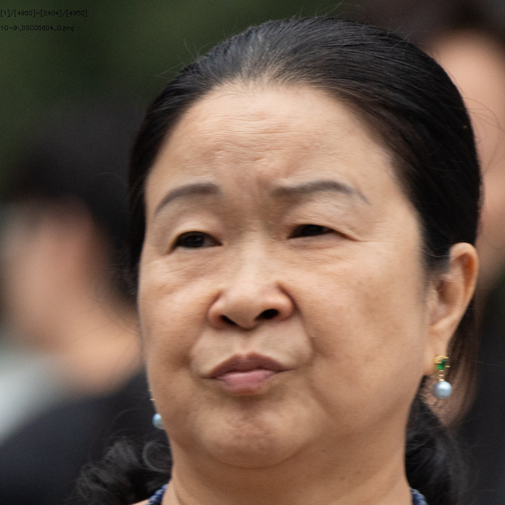
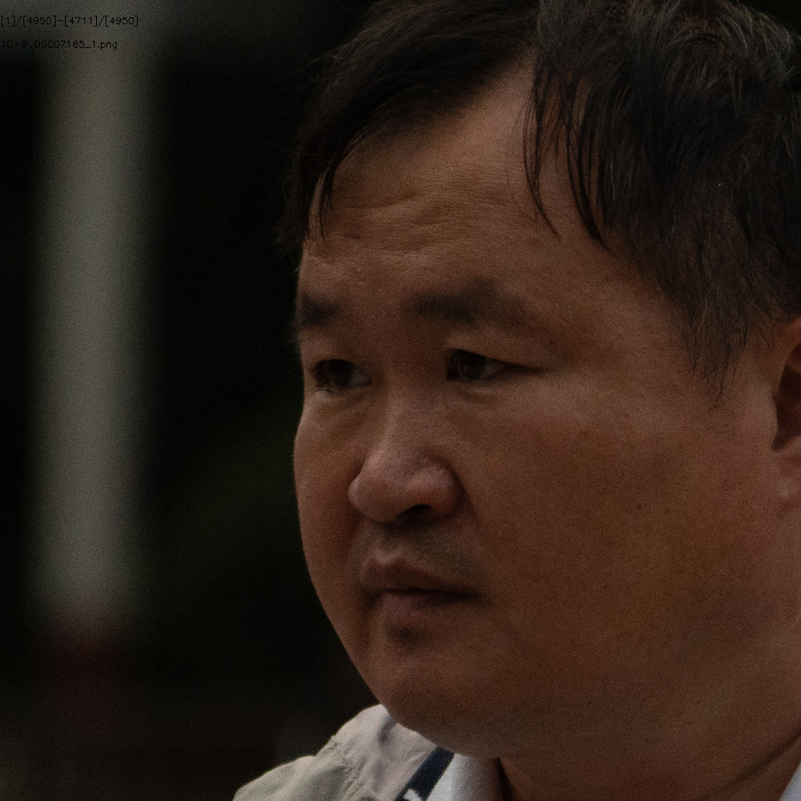

# 405人10.9号

## 总体情况统计

+ ### ID数目

  + 源ID：**405**
  + 有效ID：**407**

+ ### 图片数量

  + 源图片有：**3411**
  + crop后图片：**4950**
  + 有效图片有：**3312**
  + 无效图片：**1638**

+ ### 参数设置
  + Crop Size：**1024**
  + Align Model：**ffhq**
  + Target Format：**png**
  + Blurry Thredhold：**30**
  + Affine Size：**16**
  + DPI：**300**

## 1.模糊

#### （1）DSC03846

#### （2）DSC03918

#### （3）DSC03936

#### （4）DSC04047

#### （5）DSC04240

#### （6）DSC04373

#### （7）DSC04570

#### （8）DSC04591

#### （9）DSC04621

#### （10）DSC04668

#### （11）DSC04852

#### （12）DSC04942

#### （13）DSC05272

#### （14）DSC05309

#### （15）DSC05515

#### （16）DSC05549

#### （17）DSC05604

#### （18）DSC05749

#### （19）DSC05974

#### （20）DSC06246

#### （21）DSC06346

#### （22）DSC06403

#### （23）DSC06513

#### （24）DSC06641

#### （25）DSC06807

## 2.侧脸

#### （1）DSC04159

#### （2）DSC06666

## 3.遮挡

#### （1）DSC04683

#### （2）DSC04989

#### （3）DSC06713

#### （4）DSC07293

## 4.噪点严重

#### （1）DSC07165

