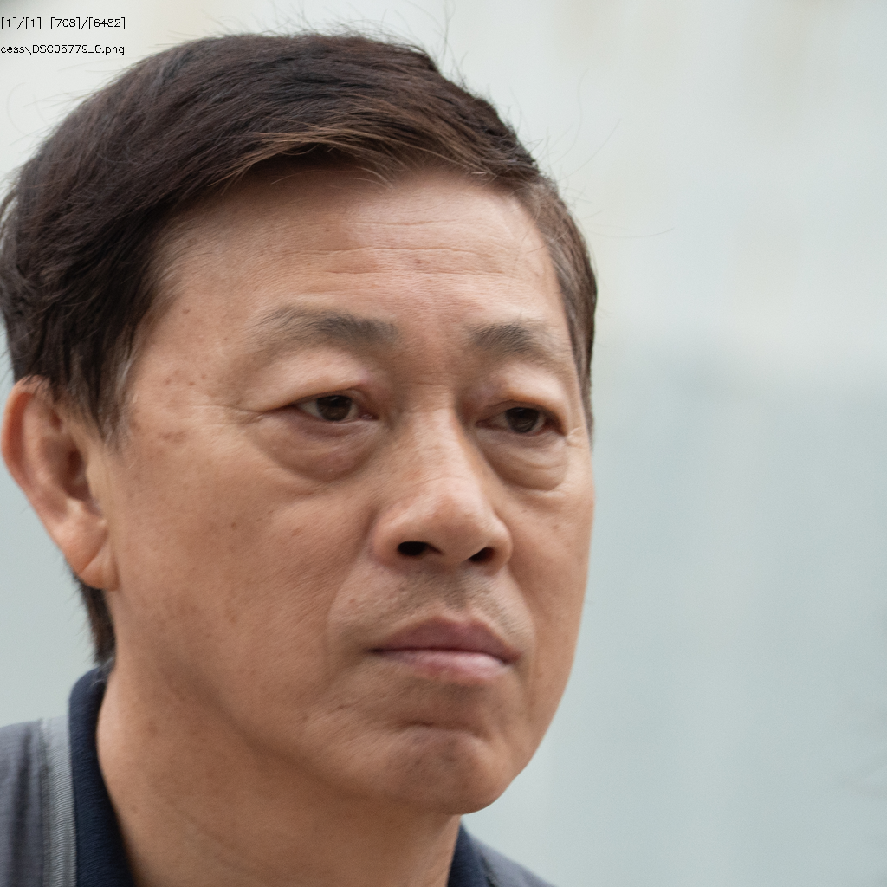

# 527人数据统计

## 总体情况统计

+ ### ID数目

  + 源ID：**527**
  + 有效ID：**521**

+ ### 图片数量

  + 源图片有：**4513**
  + crop后图片：**6482**
  + 有效图片有：**4334**
  + 无效图片：**2148**

+ ### 参数设置

  + Crop Size：**1024**
  + Align Model：**ffhq**
  + Target Format：**png**
  + Blurry Thredhold：**30**
  + Affine Size：**16**
  + DPI：**300**

## 1.模糊

#### （1）DSC05335

#### （2）DSC05498

#### （3）DSC05708

#### （4）DSC05735

#### （5）DSC05779

#### （6）DSC05990

#### （7）DSC06170

#### （8）DSC06779

#### （9）DSC06844

#### （10）DSC07006

#### （11）DSC07025

#### （12）DSC07059

#### （13）DSC07249

#### （14）DSC07582

#### （15）DSC07659

#### （16）DSC07813

#### （17）DSC08144

#### （18）DSC08288

#### （19）DSC08420

#### （20）DSC08425

#### （21）DSC08495

#### （22）DSC08503

#### （23）DSC08753

#### （24）DSC08804

#### （25）DSC08987

#### （26）DSC09239

#### （27）DSC09427

#### （28）DSC09445

#### （29）DSC09492

#### （30）DSC09630

#### （31）DSC09840

#### （32）DSC09934

## 2.遮挡

#### （1）DSC05596

#### （2）DSC07442

#### （3）DSC08688

#### （4）DSC08715

## 3.侧脸

#### （1）DSC05409

#### （2）DSC05494

#### （3）DSC07771

#### （4）DSC07880

#### （5）DSC07999

#### （6）DSC08499

