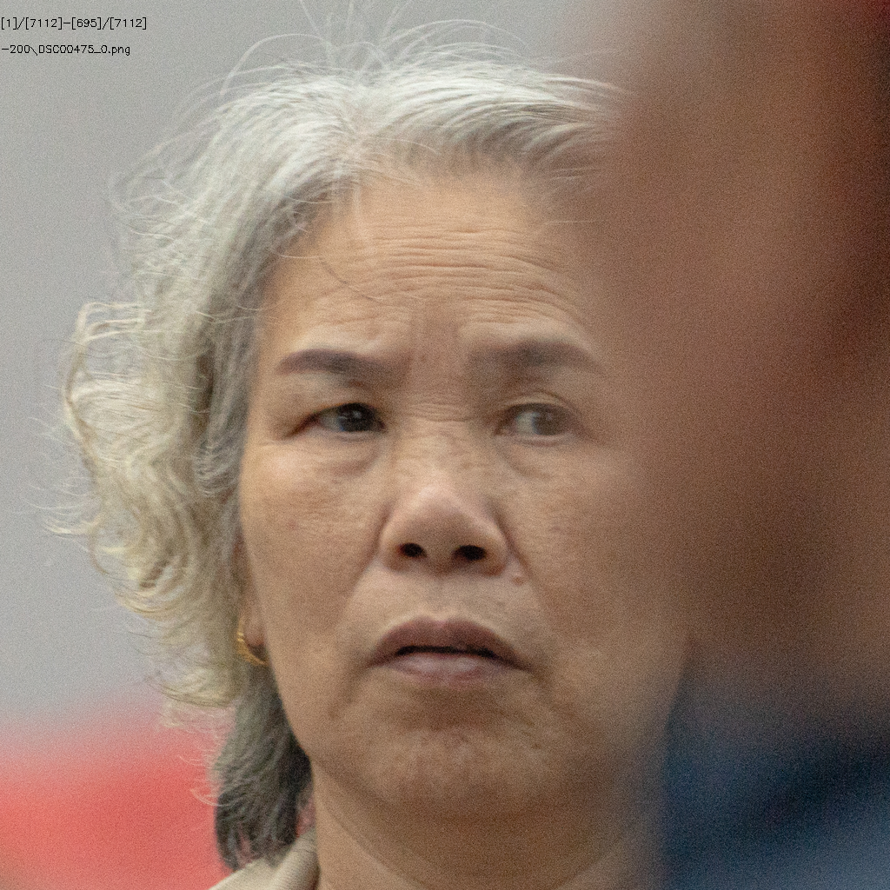
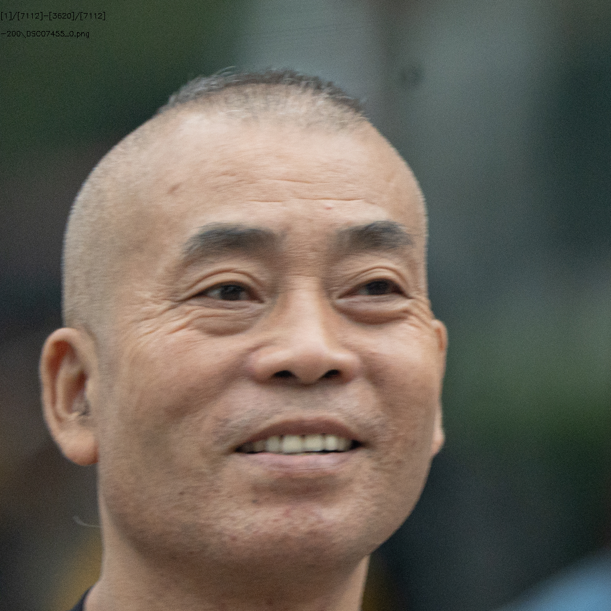
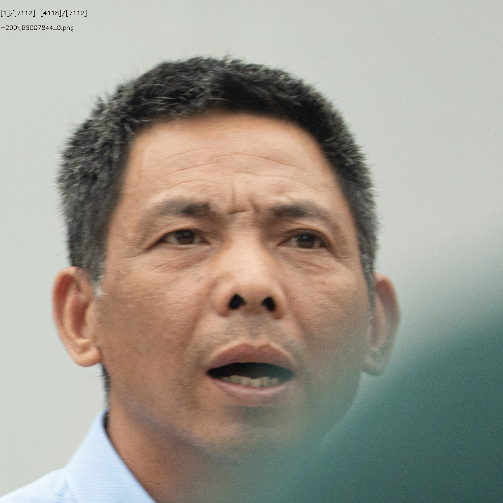
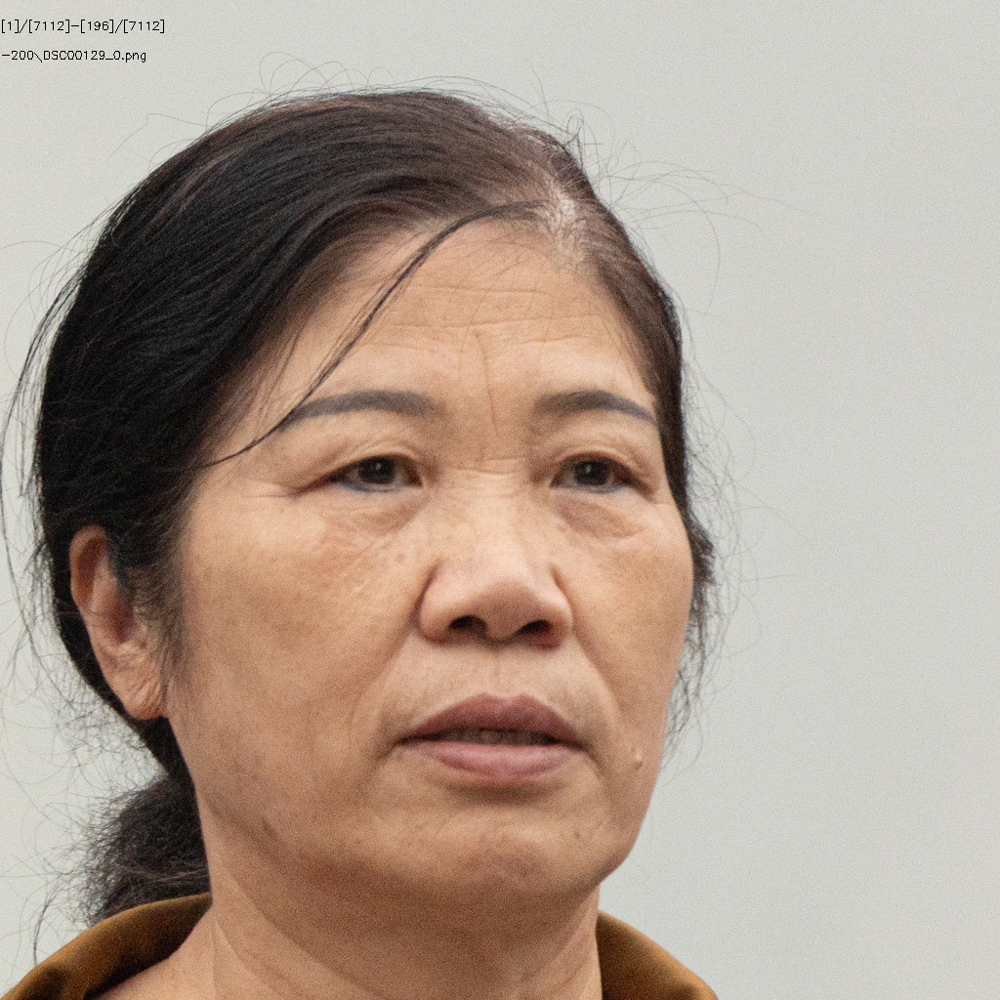

# 734人数据统计

## 总体情况统计

+ ### ID数目

  + 源ID：**734**
  + 有效ID：**725**

+ ### 图片数量

  + 源图片有：**5132**
  + crop后图片：**7112**
  + 有效图片有：**4628**
  + 无效图片：**2484**

+ ### 参数设置

  + Crop Size：**1024**
  + Align Model：**ffhq**
  + Target Format：**png**
  + Blurry Thredhold：**30**
  + Affine Size：**16**
  + DPI：**300**

## 1.模糊

#### （1）DSC00061

#### （2）DSC00156

#### （3）DSC00200

#### （4）DSC00341

#### （5）DSC00475

#### （6）DSC00504

#### （7）DSC05304

#### （8）DSC05460

#### （9）DSC05599

#### （10）DSC05599

#### （11）DSC05634

#### （12）DSC05652

#### （13）DSC05862

#### （14）DSC05946

#### （15）DSC05982

#### （16）DSC06025

#### （17）DSC06166

#### （18）DSC06182

#### （19）DSC06236

#### （20）DSC06275

#### （21）DSC06282

#### （22）DSC06401

#### （23）DSC06536

#### （24）DSC06643

#### （25）DSC06655

#### （26）DSC06730

#### （27）DSC06751

#### （28）DSC06845

#### （29）DSC07011

#### （30）DSC07138

#### （31）DSC07171

#### （32）DSC07268

#### （33）DSC07419

#### （34）DSC07466

#### （35）DSC07455

#### （36）DSC07542

#### （37）DSC07564

#### （38）DSC07686

#### （39）DSC07785

#### （40）DSC07844

#### （41）DSC08028

#### （42）DSC08243

#### （43）DSC08727

#### （44）DSC08741

#### （45）DSC08827

#### （46）DSC08859

#### （47）DSC08932

#### （48）DSC09043

## 2.侧脸

#### （1）DSC06428

## 3.遮挡

#### （1）DSC05433

#### （2）DSC06839

## 4.噪点

#### （1）DSC00121

#### （2）DSC00129

#### （3）DSC00150

#### （4）DSC00185

#### （5）DSC00232

#### （6）DSC00242

#### （7）DSC00401

#### （8）DSC07303

#### （9）DSC08586

