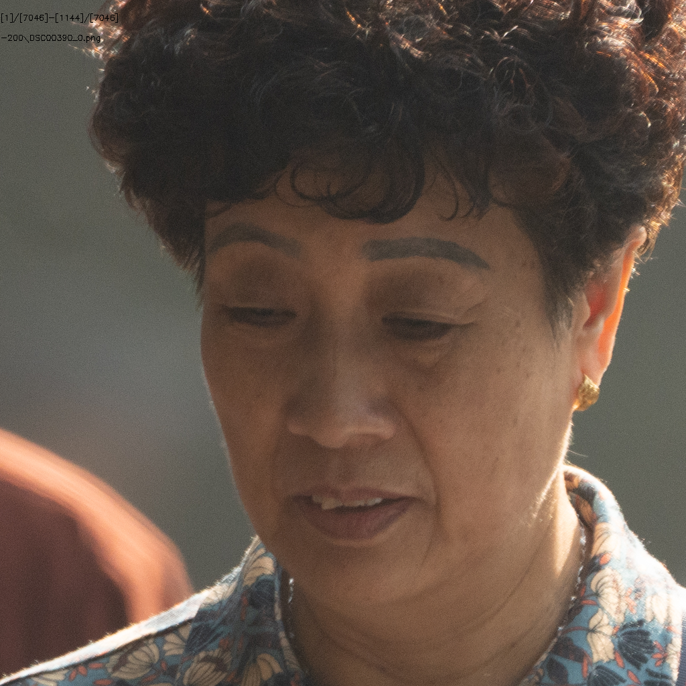
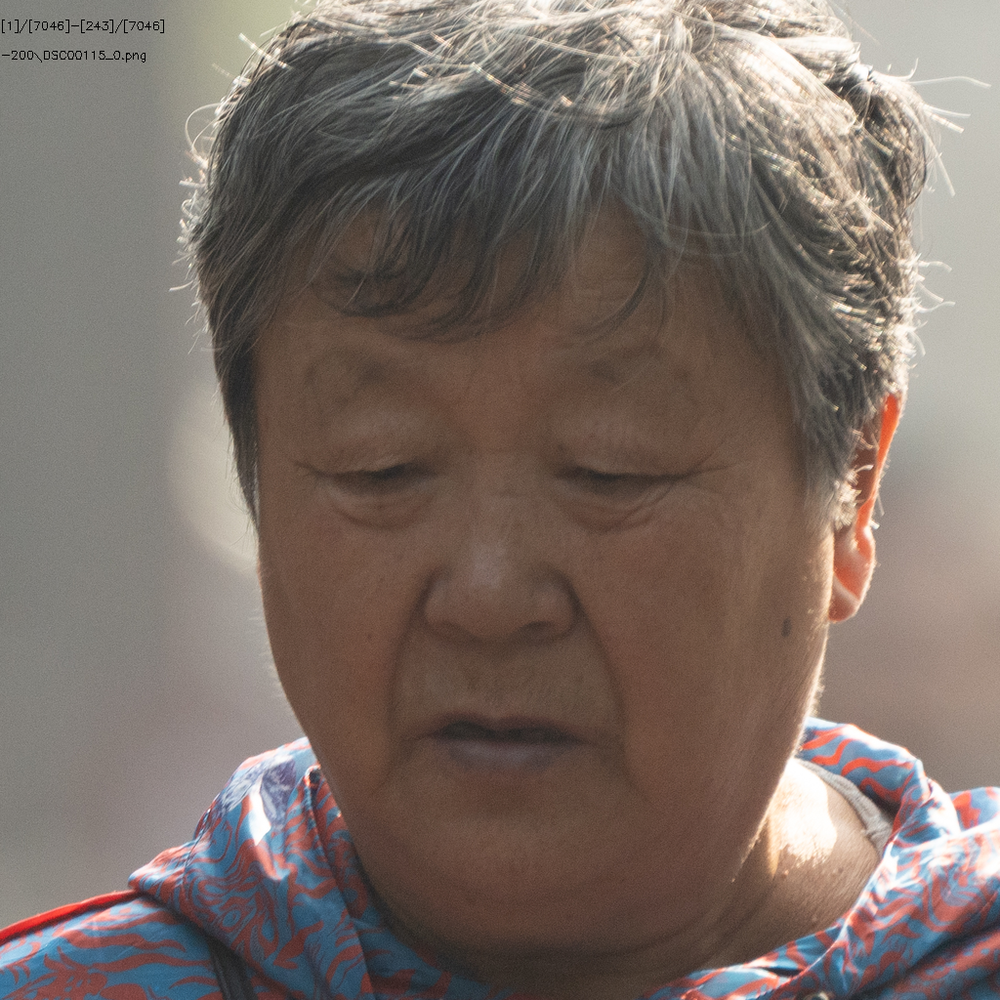

# 769人数据处理

## 总体情况统计

+ ### ID数目

  + 源ID：**769**
  + 有效ID：**492**

+ ### 图片数量

  + 源图片有：**6851**
  + crop后图片：**7046**
  + 有效图片有：**3062**
  + 无效图片：**3984**

+ ### 参数设置

  + Crop Size：**1024**
  + Align Model：**ffhq**
  + Target Format：**png**
  + Blurry Thredhold：**200**
  + Affine Size：**16**
  + DPI：**300**

+ **前后的噪点图片太多了**

## 1.模糊

#### （1）DSC00090

#### （2）DSC00106

#### （2）DSC00112

#### （3）DSC00324

#### （4）DSC00494

#### （5）DSC00293

#### （6）DSC00315

#### （7）DSC00377

#### （8）DSC00354

#### （9）DSC00390

#### （10）DSC00494

#### （11）DSC00572

#### （12）DSC00851

#### （13）DSC00897

#### （14）DSC01192

#### （15）DSC01622

#### （16）DSC01764

#### （17）DSC01790

#### （18）DSC03026

#### （19）DSC03066

## 2.侧脸

#### （1）DSC00466

#### （2）DSC00458

## 3.遮挡

#### （1）DSC00569

#### （2）DSC02420

## 4.噪点图片（特别多，前2000张基本上全是这种图片）

#### （1）DSC00071

#### （2）DSC00177

#### （3）DSC00185

#### （4）DSC00270

#### （5）DSC00391

#### （6）DSC00066

#### （7）DSC00086

#### （8）DSC00095

#### （9）DSC00105

#### （10）DSC00114

#### （11）DSC00208

#### （12）DSC00225

#### （13）DSC00275

#### （14）DSC00311

#### （15）DSC00342

#### （16）DSC00404

#### （17）DSC00489

#### （18）DSC02103

